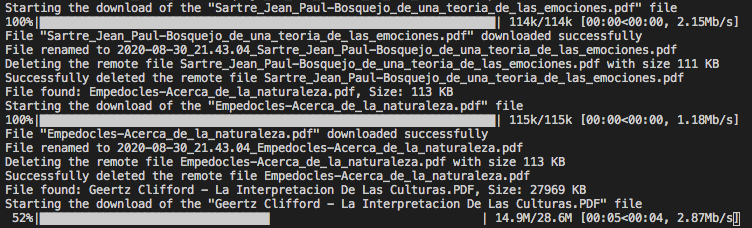

[Lea esto en **castellano**](README.es.md) · [Llegiu això en **català**](README.ca.md)

# Simple and secure backup
## Secure download remote files to our machine using SSH / SFTP

Simple Python program with which files are downloaded from a folder on a remote server, to store them as backup copies on our local computer. It is useful to download backup copies of web control panels, databases, etc.

The download can be automated by programming it using Cron or Systemd (Linux), Automator (Mac OS) or the Task Scheduler (Windows). It works using the SSH / SFTP protocol and a secure connection is established between our computer and the remote server, away from prying eyes.

The current date is automatically added to your downloaded file name in downloaded files, so they can always be stored in the same local folder and files with the same name will not be overwritten.

Configurable options:

- Write an activity log.
- Automatically delete remote files once downloaded locally.

Requirements:

- The remote server must allow access via SSH and perhaps have the SFTP option activated. It can be easily configured on your domain control panel.
- Have access data by terminal to the remote server: user, password, port (usually 22) and folder where the files are.
- Python 3 installed with the `paramiko` and `tqdm` modules. Valid for any system: Windows, Mac OS, Linux. Tested in Python 3.8.

Instructions:

- Download these files to your computer by cloning the project or as a compressed zip.
- Open the file `download_config.py` with any plain text editor, add the connection data and the desired options. There are examples in the file `download_config_sample.py`
- Run the file `download_backup.py` by calling the Python interpreter (`python3 download_backup.py`). On Linux and Mac OS you can give it command line permissions to run without calling the interpreter: `chmod +x download_backup.py`

Terminal sample:

